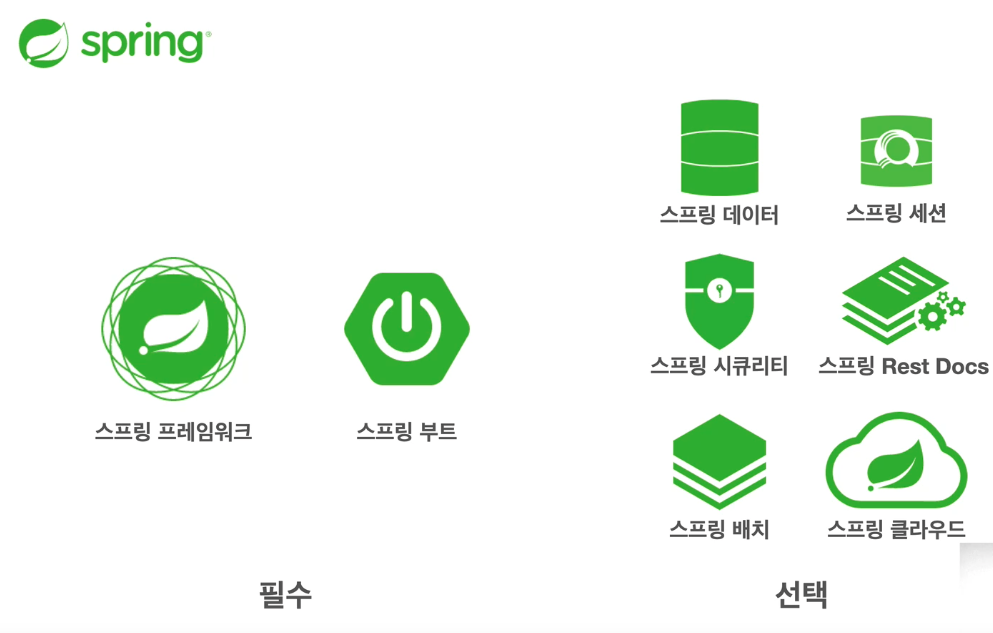

# 1. 객체 지향 설계와 스프링

by 김보배

---

### 스프링

다양한 기술들이 존재합니다.

### 스프링의 프레임워크

### **스프링 부트란?**

우리가 배우고자 하는 스프링 부트는 **"스프링을 편리하게 사용할수 있도록 지원하는 프레임워크"** 입니다.

최근에는 기본으로 스프링 부트를 사용해 프로젝트를 구성합니다.

- 단독으로 실행할 수 있는 스프링 애플리케이션 쉽게 생성 가능
- Tomcat 같은 웹 서버 내장, 여러 기능에 대한 starter 종속성 제공
- Metric, 상태확인 등 Production 준비 기능 제공

### 스프링의 핵심

자바 언어 기반의 프레임워크 → 객체지향 언어 → **좋은 객체 지향 애플리케이션**을 개발할 수 있게 도와주는 프레임워크

### 좋은 객체지향 프로그래밍?

객체 지향 프로그래밍의 의미는 컴퓨터 프로그램을 명령어의 목록으로 보는 시각에서 벗어나 여러 개의 독립된 단위인 **객체**들의 **모임**으로 파악하고자 하는 것입니다. 각각의 **객체**는 **메세지**를 주고받고, 데이터를 처리할 수 있습니다. (**협력**) 

프로그램을 마치 컴퓨터 부품을 갈아 끼우듯이, **유연**하고 **변경**이 용이하게 만들어주기 때문에 대규모 소프트웨어 개발에 많이 사용됩니다.

이것이 말하는 것이 객체지향의 핵심 중 하나인 '다형성'입니다.

### 다형성

다형성 설명을 위해, 세상을 **역할과 구현**으로 구분해 예시를 들어봅시다.

- 자동차라는 역할 → 구현체로 K3, 아반떼, 테슬라 모델3 등이 있습니다.
- 로미오와 줄리엣의 역할 → 구현체로 장동건과 원빈, 그리고 김태희와 송혜교 등이 있습니다.

이렇게 역할과 구현을 구분하면, 세상이 단순 및 유연해지며 변경도 편리해집니다.

- 클라이언트는 대상의 역할(인터페이스)만 알면 됩니다.
- 클라이언트는 구현 대상의 내부 구조를 몰라도 됩니다.
- 클라이언트는 구현 대상의 내부 구조가 변경되어도 영향을 받지 않습니다.
- 클라이언트는 구현 대상 자체를 변경해도 영향을 받지 않습니다.

자바도 이 다형성의 개념을 활용했습니다. 역할과 구현을 나누는 것에 인터페이스와 클래스를 사용했습니다.

- 객체 설계 시에 인터페이스(역할)을 먼저 생성한 뒤, 그 인터페이스를 구체화한 클래스(구현)을 생성해야 합니다.
- 자바에선 이런 것을 **오버라이딩**이라고 부릅니다.

다형성의 본질은 인터페이스를 구현한 객체 인스턴스를 **실행 시점**에 **유연**하게 **변경**할 수 있다는 점입니다.

- 다형성의 본질을 이해하려면 '협력'이라는 객체사이의 관계에서 시작해야 합니다.

즉, 다형성을 통해 **클라이언트를 변경하지 않고, 서버의 구현 기능을 유연하게 변경 가능**하다는 점이 핵심이라고 말할 수 있습니다.

### 스프링과 객체지향

다시 돌아와서 스프링은 좋은 객체지향 어플리케이션을 개발하는데 도움을 준다고 했습니다.

- 또, 객체지향 중 핵심 (중 하나)는 다형성이라고 했습니다.

**즉, 스프링은 다형성을 극대화해서 이용할 수 있게 도와줍니다.**

- 제어의 역전(IoC), 의존관계 주입(DI)는 다형성을 활용해 역할과 구현을 편리하게 다룰 수 있도록 지원합니다.

### 좋은 객체 지향 설계의 원칙: SOLID

- SRP (Single Responsibility Principle): 단일 책임 원칙

    한 클래스는 하나의 책임만을 가져야 합니다. 이때 하나의 책임을 구분하는 기준은 **변경**입니다. 변경이 있을 때 파급 효과가 적으면 단일 책임 원칙을 잘 따른 것으로 볼 수 있습니다.

- OCP (Open / Closed Principle): 개방 / 폐쇄 원칙

    소프트웨어 요소는 **확장에는 열려있으나 변경에는 닫혀있어야 합니다.** 확장을 하려면 당연히 기존 코드를 변경해야 한다고 생각할 수 있지만, **다형성**을 활용한다면, **역할과 구현의 분리**를 생각해보면 가능합니다.

    그러나 순수 자바 언어로는 다형성을 사용했어도 OCP 원칙을 지킬 수는 없습니다. (코드를 수정/변경해야합니다)  이를 해결하기 위해서, 객체를 생성하고 연관관계를 맺어주는 별도의 조립 및 설정자가 필요합니다. 이 부분을 스프링에서 도맡아 줍니다.

- LSP (Liskov Substitution Principle): 리스코프 치환 원칙

    프로그램의 객체는 프로그램의 정확성을 깨뜨리지 않으면서 하위 타입의 인스턴스로 바꿀 수 있어야 합니다. 이는 인터페이스를 구현한 구현체를 믿고 사용하기 위한 원칙으로, 하위 클래스는 인터페이스 규약을 다 지켜야 함을 뜻합니다. 

    **단순히 컴파일에 성공하는 것을 넘어서, 자동차 인터페이스의 엑셀은 앞으로 가라는 기능인데 이를 뒤로 가게 구현하면 LSP에 위반되는 것처럼, 인터페이스 규약을 따라야 합니다.**

- ISP (Interface Segregation Principle): 인터페이스 분리 원칙

    클라이언트를 위한 인터페이스 여러 개가 하나의 범용 인터페이스보다 제 역할을 다합니다. 자동차 인터페이스는 운전 인터페이스와 정비 인터페이스로 분리하는 것과 같이, 인터페이스가 명확해지고 대체 가능성이 높아집니다. **동시에 하나의 인터페이스가 변하더라도 운전자 클라이언트에 영향을 주지 않게 됩니다.**

- DIP (Dependnecy Inversion Principle): 의존관계 역전 원칙

    프로그래머는 구체화에 의존하지 않고, **추상화에 의존**해야 합니다. **즉, 역할에 의존해야 하는 것입니다.**

    그러나 OCP와 마찬가지로 다형성을 사용했더라도 DIP 원칙을 지킬 수는 없습니다. 클라이언트가 구현 클래스를 직접 선택하여 인터페이스와 구현 클래스를 동시에 의존합니다. 이 문제를 스프링에서 해결해줍니다.

### 객체 지향 설계와 스프링

다형성만으로는 OCP와 DIP를 지키기 힘듭니다. 

- 구현 객체를 변경할 때, 클라이언트 코드도 함께 변경됩니다.

이를 위해 스프링이 등장했고, 이외에도 객체 지향을 위해 추가적인 강점을 제공합니다.

- DI (Dependency Injection) 개념과 DI 컨테이너를 제공하여 다형성와 OCP, DIP를 가능하게 지원합니다.
- 클라이언트 코드의 변경없이 기능을 확장하도록 도와줍니다.