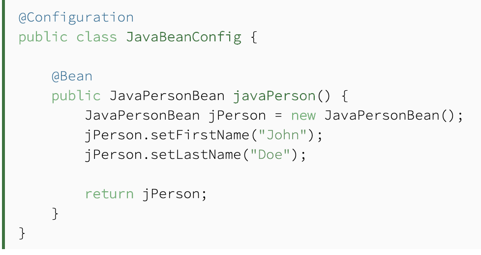
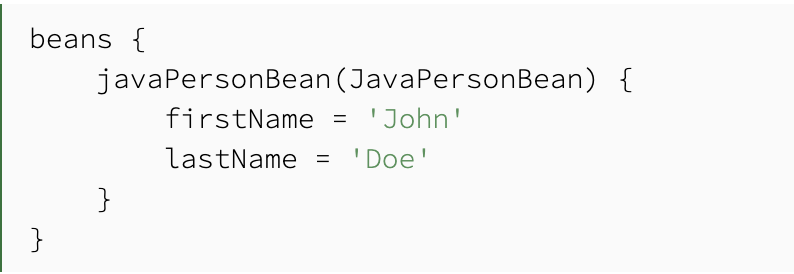
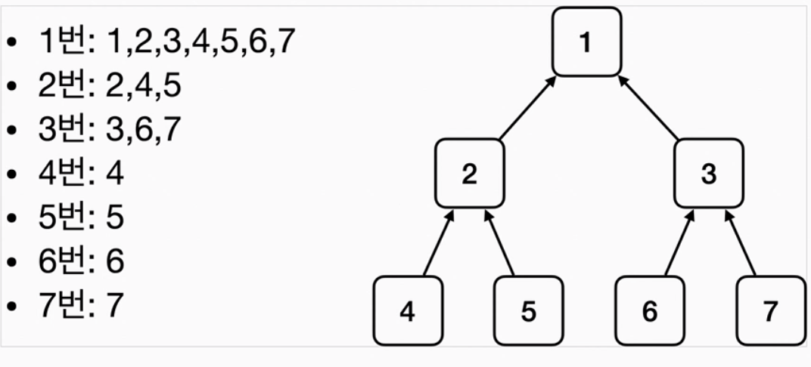
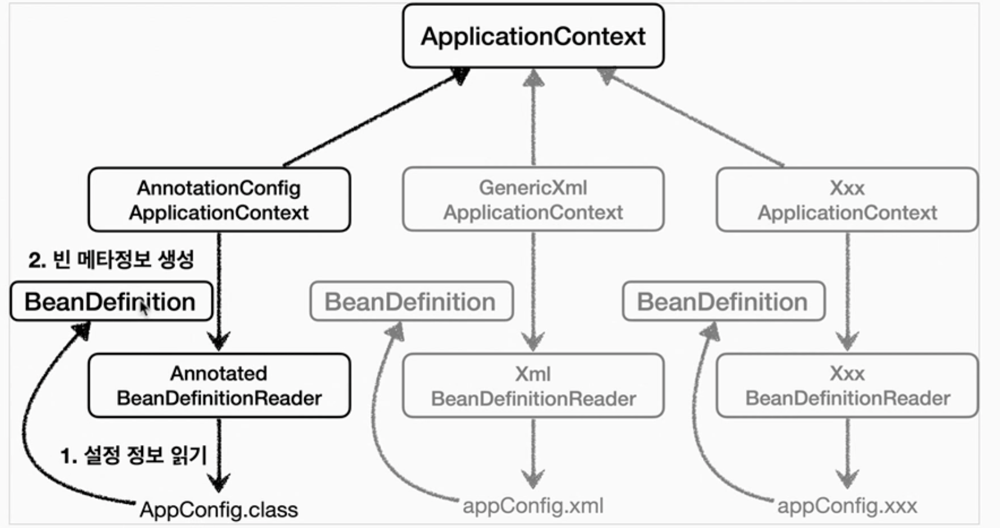
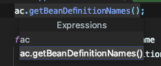
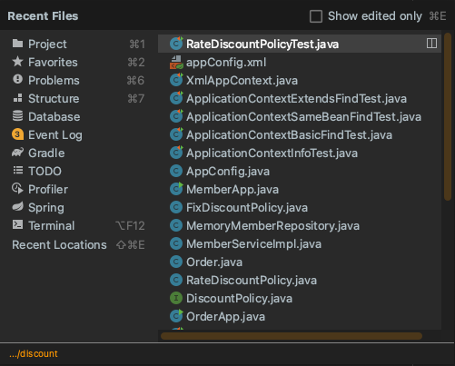

# Spring Container & Spring Bean

스프링 컨테이너

"BeanFactory"

- 스프링 컨테이너의 최상위 인터페이스
- 스프링 빈을 관리하고 조회하는 역할을 한다.

"ApplicationContext"

- BeanFactory 기능을 모두 상속받아서 제공한다.
- 애플리케이션을 개발할때는 빈을 관리하고 조회하는 기능은 물론이고, 수 많은 부가 기능이 필요해서 필요함
- 예) MessageSource, EnvironmentCapable, ApplicationEventPublisher, ResourcePatternResolver등등..
    - "메시지소스를 활용한 국제화 기능" - 언어를 변경할때
    - "환경변수" - 로컬, 개발, 운영등을 구분해서 처리
    - "애플리케이션 이벤트" - 이벤트를 발행하고 구독하는 모델을 편리하게 지원
    - "편리한 리소스 조회" - 파일, 클래스패스, 외부 등에서 리소스를 편리하게 조회

자바코드, XML

- 스프링컨테이너는 다양한 형식의 설정 정보를 받아드릴 수 있게 유연하게 설계되어 있다.
    - 자바코드, XML, Groovy 등

    

    

    Groovy Example

- 보통은 자바코드로 설정을 사용함: 어노테이션, AnnotationConfigApplicationContext 사용
- XML 설정 사용
    - 컴파일 없이 빈 정보를 수정 가능

스프링 빈 조회 - 상속 관계

- 부모 타입으로 조회하면 모든 하위 타입의 빈을 조회 할 수 있다.
- Object - 가장 상위 타입의 빈으로 조회 하게 되면 모든 bean을 조회 할 수 있다.

스프링 빈 설정 메타 정보 - BeanDefinition

- 스프링의 다양한 설정 형식을 지원하는 방식
    - BeanDefinition이라는 추상화가 존재하고, 역할과 구현을 개념적으로 나눈 것
- 스프링 컨테이너는 이 메타정보를 기반으로 스프링 빈을 생성한다.
- BeanDefinition을 직접 생성해서 스프링 컨테이너에 등록도 가능.
- 자바 - FactoryBean을 통해서 BeanDefinition을 설정.
- XML - 직접적으로 BeanDefinition을 설정한다.

강의에서 배운 꿀팁

Command + Option + V ⇒ 타입에 따라 변수명과 타입까지 완성시켜줌..

Command + E + Enter ⇒ 최근 파일로 쉽게 옮김.

Command + Option + B ⇒ 선택된 메소드의 구현 객체로 바로 가짐.. 추상화 클래스 패스